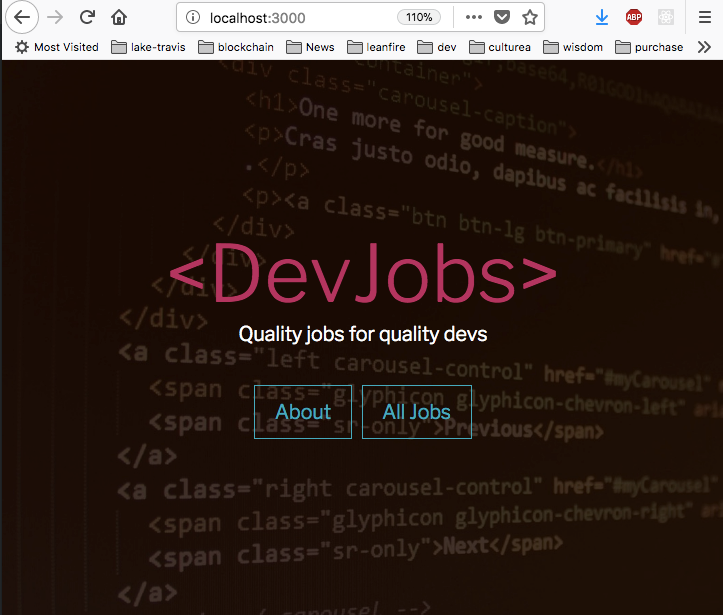
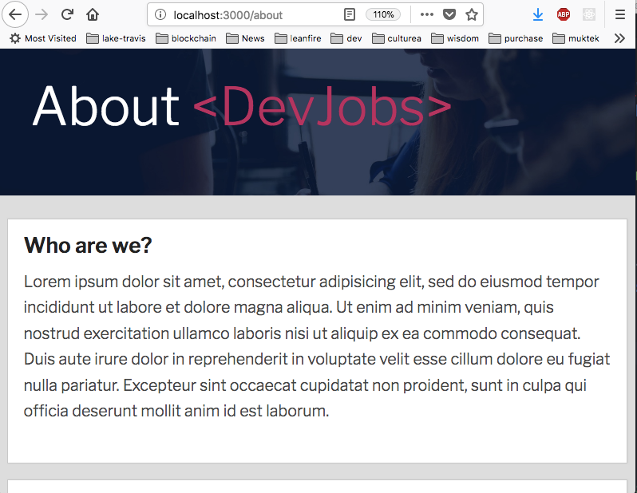
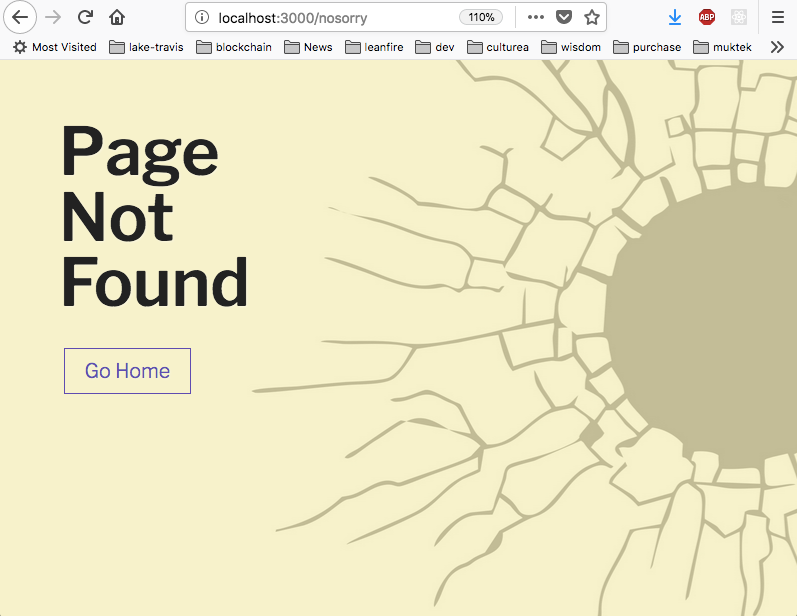

# Full Stack JS Project
**`fullstack-js-03-views-and-static-files`**


## Context
You are going to build a full stack web application with node.js + React. In order to become familiar with how a node project works, you will be responsible for configuring the  initial major components of the project.  

- express server
- application routes
- **views [this assignment]**
- api layer
  - data access
  - data models (ORM)
  - RESTful routes


## The Assignment
For this assignment, we will focus on creating the **views** and configuring our application to serve serving static files (.css, .js, image files)

### Requirements

- You will need to install EJS as a project dependency and require it into `server.js`

- You will need to configure EJS as the view engine
  - You will need to register `ejs.renderFile` function as the template engine in your application using `app.engine(...)`
  - You will need to set the express the 'view engine' as 'ejs'
  - You will need to set the path to the views (the file location that express will look for view files).

- Inside the routes, you will need to use `res.render()` to render the appropriate `.ejs` view inside the router

- You will need to serve static files (CSS files, JS files, and images) from the `/public` directory using `express.static`

- You will need to correctly write the `<link>` to the styles file (located at `public/css/style.css`) in the `home.ejs`, `about.ejs`, and `404.ejs` files.

### Expected Results

- When I navigate to the root path ('/' @ http://localhost:3000), I should see (the page content of `home.ejs` AND the css styles):

  


- When I navigate to the root path ('/about' @ http://localhost:3000/about), I should see (the page content of `about.ejs` AND the css styles):

  


- When I navigate to a route that does NOT exist (example: http://localhost:3000/oopsoops), I should see (the page content of `404.ejs` AND the css styles):

  


### Setup Instructions

In Terminal:

```sh
# (1) navigate to your project--devjobs directory
cd ~/Documents/muktek/assignments/project--devjobs

# (2) Commit your changes from the previous demo
git commit -m 'committing work from part-02'

# (3) Merge your changes to the master branch
git checkout master
git merge part-02-server-router

# (4) You will work on the part-03-views branch for this feature
git checkout -b part-03-views-and-static-files

# (5) Download + unzip files into public/
curl https://raw.githubusercontent.com/muktek/assignment--fullstack-js-03-views-and-static-files/master/publicfiles.zip > publicfiles.zip

unzip publicfiles.zip -d ./public/


# (6) Download + unzip files into src/views
curl https://raw.githubusercontent.com/muktek/assignment--fullstack-js-03-views-and-static-files/master/viewfiles.zip  > viewfiles.zip

unzip viewfiles.zip -d ./src/views/

# (7) Delete the zip files
rm *.zip


```
